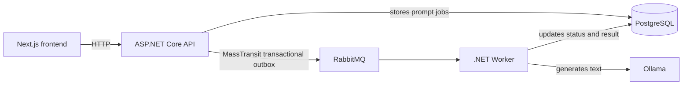

# Prompt Processing

Prompt Processing is a small asynchronous prompt-processing system. Users submit multiple prompts through a Next.js UI, track their progress, and read generated results from a local Ollama model.

The main flow is: submit prompts → persist jobs → publish messages → process them in a background worker → track the final status and result in the UI.

## Architecture



## Key technical decisions

- **Clean Architecture** — the Domain layer contains prompt job rules, Application holds use cases and validation, Infrastructure contains EF Core, MassTransit and Ollama integrations, while API and Worker are delivery mechanisms.
- **Transactional outbox** — API writes the prompt job and the outgoing MassTransit message in one database transaction, reducing the risk of a persisted job without a queued message.
- **Cursor pagination** — prompt history is ordered by `CreatedAtUtc` and `Id`, which keeps pagination stable when multiple jobs share the same timestamp.
- **Focused polling** — the frontend polls only jobs in `Pending` or `Processing` states; completed and failed jobs do not generate further status requests.
- **Docker Compose orchestration** — the complete development stack starts with one command. A dedicated migrator container applies EF Core migrations before the API and Worker start.

> **Reliability:** The worker provides at-least-once message processing with idempotent handling of terminal job states. If it fails after Ollama returns a response but before `Completed` is persisted, the response may be generated again after redelivery.

## Quick start

### Prerequisites

- Docker Desktop with Docker Compose enabled

### Run the complete stack

```powershell
docker compose up --build
```

The first run downloads the `llama3.2:1b` Ollama model (about 1.3 GB), so it may take longer than subsequent starts. PostgreSQL, RabbitMQ and Ollama data are persisted in Docker named volumes.

| Service | URL |
|---|---|
| Frontend | http://localhost:3000 |
| API | http://localhost:8080 |
| API reference (Scalar) | http://localhost:8080/scalar/v1 |
| RabbitMQ Management | http://localhost:15672 |
| Ollama | http://localhost:11434 |

Stop the stack while preserving data:

```powershell
docker compose down
```

Reset the complete local environment, including database data and the downloaded model:

```powershell
docker compose down -v
```

## Verify the flow

1. Open http://localhost:3000.
2. Enter several prompts, one prompt per line, and select **Add to queue**.
3. Observe each job move through `Pending`, `Processing`, and then `Completed` or `Failed`.
4. Confirm that a completed job displays its generated result and a failed job displays its error.
5. Add more than five jobs and scroll to the end of the history to verify cursor-based lazy loading.

## API

Scalar exposes the full OpenAPI documentation. The main endpoints are:

| Method | Endpoint | Purpose |
|---|---|---|
| `POST` | `/api/prompt-jobs` | Create one or more prompt jobs. |
| `GET` | `/api/prompt-jobs?take=5&cursor={cursor}` | Read a cursor-paginated prompt job history. |
| `GET` | `/api/prompt-jobs/status?ids={id}` | Read current states for selected prompt jobs. |

## Local development

Docker Compose is the recommended way to run the full system. To work on the application processes locally, start the infrastructure services first:

```powershell
docker compose up postgres rabbitmq ollama ollama-model
```

Apply the current database migrations:

```powershell
dotnet ef database update --project PromptProcessing.Infrastructure --startup-project PromptProcessing.Api --context ApplicationDbContext
```

Create `PromptProcessing.Web/.env` from `.env.example` and configure the local HTTPS API:

```text
NEXT_PUBLIC_API_URL=https://localhost:7053
```

Then start the API, Worker and frontend in separate terminals:

```powershell
dotnet run --project PromptProcessing.Api --launch-profile https
```

```powershell
dotnet run --project PromptProcessing.Worker
```

```powershell
cd PromptProcessing.Web
npm run dev
```

## Validation

Run backend tests:

```powershell
dotnet test PromptProcessing.slnx
```

Run frontend checks:

```powershell
cd PromptProcessing.Web
npm run lint
npm run build
```

## Troubleshooting

| Problem | Resolution |
|---|---|
| A port is already in use | Stop the conflicting local process or run `docker compose down` before starting the stack again. |
| The first startup takes a long time | Check `docker compose logs ollama-model`; the initial model download is expected to take time. |
| Local data needs to be reset | Run `docker compose down -v`, then run `docker compose up --build` again. |
| The stack stops at the migrator service | Run `docker compose logs migrator --tail=200` and confirm that the current EF Core migration files are committed. |
