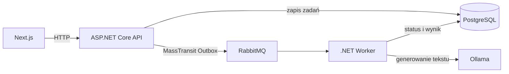

# Prompt Processing

System do asynchronicznego przetwarzania wielu promptów przez lokalny model Ollama. Użytkownik dodaje prompty w aplikacji webowej, a Worker odbiera zadania z RabbitMQ, generuje odpowiedzi i zapisuje ich status w PostgreSQL.

## Architektura



## Uruchomienie całego systemu

Wymagany jest Docker Desktop z włączonym Docker Compose.

```powershell
docker compose up --build
```

Pierwsze uruchomienie pobierze model `llama3.2:1b` (około 1,3 GB), więc może potrwać dłużej. Kolejne uruchomienia korzystają z named volumes.

Po uruchomieniu dostępne są:

| Usługa | Adres |
|---|---|
| Frontend | http://localhost:3000 |
| API | http://localhost:8080 |
| Dokumentacja API (Scalar) | http://localhost:8080/scalar/v1 |
| RabbitMQ Management | http://localhost:15672 |
| Ollama | http://localhost:11434 |

Domyślne dane RabbitMQ: `guest` / `guest`.

Compose uruchamia jednorazową usługę `migrator`, która wykonuje migracje EF Core przed startem API i Workera.

Zatrzymanie usług:

```powershell
docker compose down
```

Usunięcie także danych lokalnych:

```powershell
docker compose down -v
```

## Przepływ zadania

1. Frontend wysyła wiele promptów do `POST /api/prompt-jobs`.
2. API zapisuje zadania w PostgreSQL i publikuje komunikaty przez transactional outbox MassTransit.
3. Worker odbiera komunikat z RabbitMQ i wywołuje Ollama.
4. Zadanie przechodzi przez stany `Pending`, `Processing`, `Completed` albo `Failed`.
5. Frontend pobiera historię kursorem po pięć elementów oraz odświeża wyłącznie aktywne statusy.

## Testy i weryfikacja

Testy backendowe:

```powershell
dotnet test PromptProcessing.slnx
```

Weryfikacja frontendu:

```powershell
cd PromptProcessing.Web
npm run lint
npm run build
```

## Uruchomienie lokalne komponentów

Pełny stack przez Docker Compose jest zalecanym sposobem. Do pracy lokalnej nad frontendem skonfiguruj `PromptProcessing.Web/.env`:

```text
NEXT_PUBLIC_API_URL=https://localhost:7053
```

Następnie uruchom API profilem `https`, Workera oraz frontend:

```powershell
dotnet run --project PromptProcessing.Api --launch-profile https
dotnet run --project PromptProcessing.Worker
cd PromptProcessing.Web
npm run dev
```
